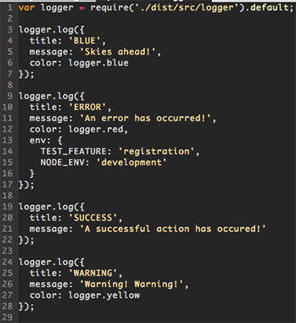

# cf-log


### A conditional logger with colored labels for node.js

A simple conditional logger for node.js. Each logging
statement is configured with a title and message. You
can optionally add a map of environment variables to
check for prior to logging and label color.

### Example Usage
```
import logger from 'cf-node-logger';

logger.logMessage({
  title: 'Request',
  message: 'Some cookies',
  env: {
    NODE_ENV: 'development',
    LOG_FEATURE: 'cookieJar'
  }
});

```

### Colors
     1. `logger.green (default)`
     2. `logger.red`
     3. `logger.blue`
     4. `logger.yellow`

This will log 'Some cookies' when the environment
variables `NODE_ENV` and `LOG_FEATURE` are set to
their respective values.

### Imagery


